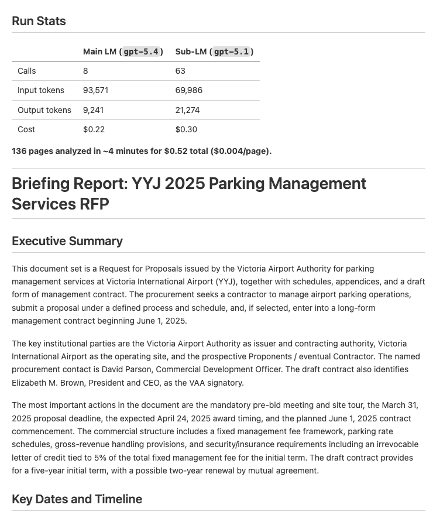
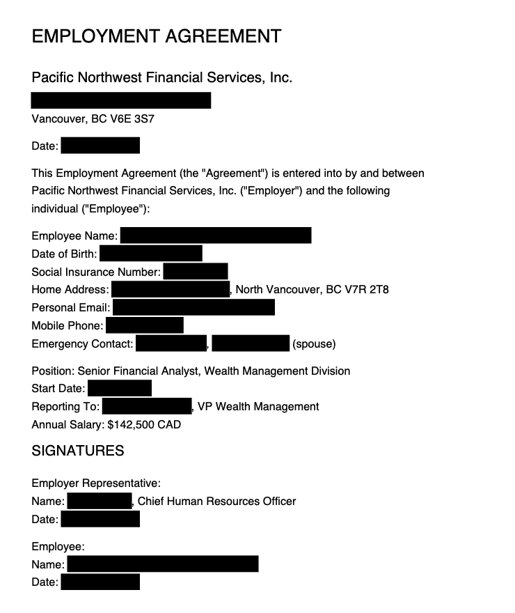
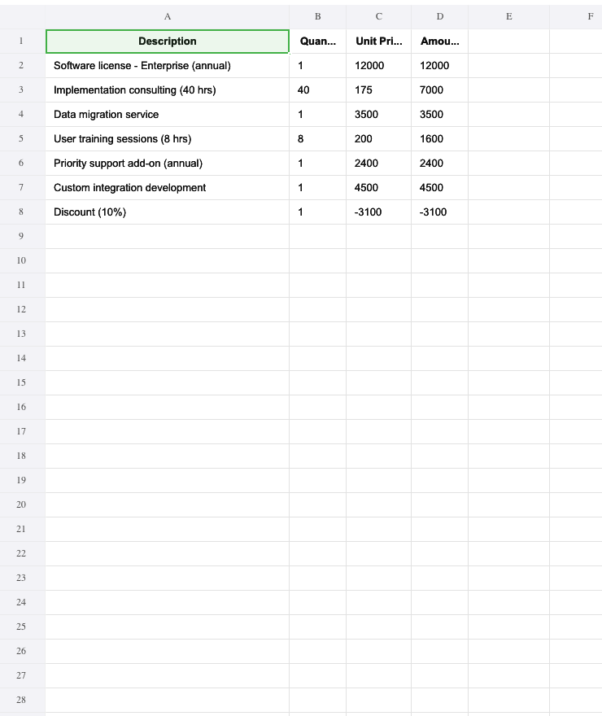
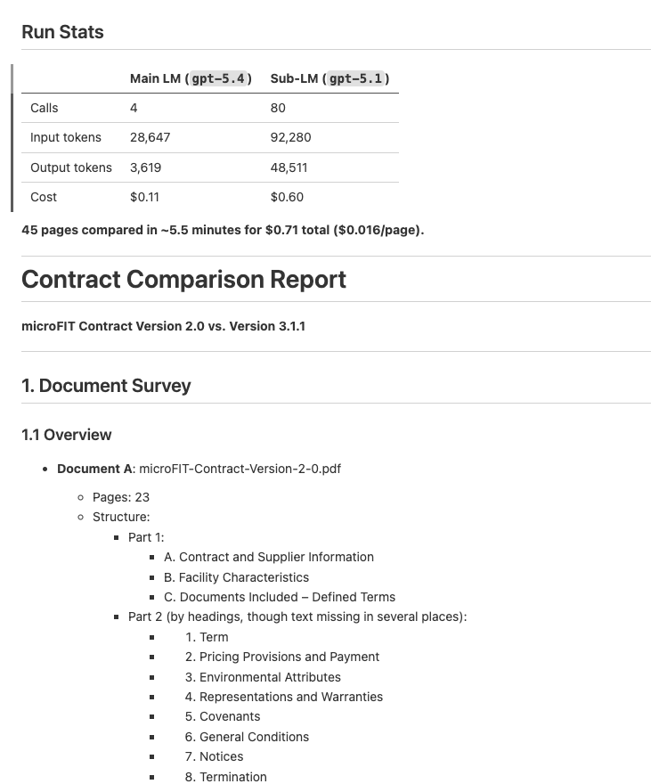

# predict-rlm

[](https://github.com/Trampoline-AI/predict-rlm/actions/workflows/tests.yml)
[](https://codecov.io/gh/Trampoline-AI/predict-rlm)
[](https://cal.com/team/trampoline)
[](https://discord.gg/BAkd288sGN)

Production-grade RLMs (Recursive Language Models) with tool use, built on [DSPy](https://github.com/stanfordnlp/dspy). By [Trampoline AI](https://www.trampoline.ai/).

Based on the [Recursive Language Models](https://arxiv.org/abs/2512.24601v1) paper by [Alex L. Zhang](https://x.com/a1zhang), [Tim Kraska](https://x.com/tim_kraska), and [Omar Khattab](https://x.com/lateinteraction) from the Stanford NLP lab.

## Installation

```bash
uv add predict-rlm
```

Or with pip:

```bash
pip install predict-rlm
```

predict-rlm also requires [Deno](https://deno.com/) for its sandboxed code interpreter:

```bash
curl -fsSL https://deno.land/install.sh | sh
```

## Quick start

```python
import dspy
from predict_rlm import File, PredictRLM

class AnalyzeImages(dspy.Signature):
    """Analyze images and answer the query. Load each image as a base64 data
    URI and use predict() with dspy.Image to extract visual information."""
    images: list[File] = dspy.InputField()
    query: str = dspy.InputField()
    answer: str = dspy.OutputField()

rlm = PredictRLM(AnalyzeImages, lm="openai/gpt-5.4", sub_lm="openai/gpt-5.1")
result = rlm(images=[File(path="page.png")], query="Extract all visible text, then count each letter A-Z (case-insensitive).")
print(result.answer)
```

### Use it with your coding agent

Add the [predict-rlm agent skill](skills/create-rlm/SKILL.md) to Claude Code, Codex, Cursor, or any compatible coding agent:

```bash
npx skills add Trampoline-AI/predict-rlm
```

Your agent will then know how to build RLMs using predict-rlm — including the file structure, signatures, tools, and skills patterns.

## Demos

| Example | Description | Input / Output | Preview |
|---|---|---|---|
| [Document Analysis](examples/document_analysis/) | Analyze documents and extract key dates, entities, and financial information into a structured report | **Input:** 1 PDF, 136 pages<br>**Output:** Structured briefing report with key dates, entities, and financial info ([sample](examples/document_analysis/sample/output/report.md)) | <a href="examples/document_analysis/sample/output/report.md"></a> |
| [Document Redaction](examples/document_redaction/) | Redact PII from PDFs based on a policy, then verify the redactions visually | **Input:** 1 PDF, 6 pages<br>**Output:** 96 PII redactions across 6 categories, verified redacted PDF ([sample](examples/document_redaction/sample/output/output.md)) | <a href="examples/document_redaction/sample/output/output.md"></a> |
| [Invoice Processing](examples/invoice_processing/) | Extract vendor info, line items, and totals from PDF invoices into a consolidated Excel spreadsheet | **Input:** 2 PDFs, 2 pages<br>**Output:** Line items, totals, and vendor info in Excel ([sample](examples/invoice_processing/sample/output/)) | <a href="examples/invoice_processing/sample/output/output.md"></a> |
| [Contract Comparison](examples/contract_comparison/) | Compare two contract versions and produce a structured diff report with per-section analysis | **Input:** 2 PDFs, 45 pages<br>**Output:** Per-section diff report with key differences ([sample](examples/contract_comparison/sample/output/)) | <a href="examples/contract_comparison/sample/output/comparison-report.md"></a> |

## Why RLMs?

Think of an RLM as a **callable, pre-configured agent**. Like Claude Code or Cursor, it can autonomously explore context, write and execute code, call tools, inspect results, and iterate until the task is done. Unlike a chat agent, an RLM is a **function** — you define its inputs, outputs, and tools, then call it from your code. It returns structured data, not chat messages.

This makes RLMs ideal for tasks that are:

- **Specific and repeatable** — tasks with a well-defined SOP and a known desired outcome. Think of an RLM as a Claude Code that's been purpose-built for one task — with the right tools, the right instructions, and a tuned workflow that reliably produces the result you want. You define the procedure once, and the RLM follows it every time.
- **Context-heavy** — too much data to fit in a single prompt. The RLM selectively loads what it needs via tools, working through documents page by page rather than stuffing everything into one call.
- **Multi-step** — require exploring, extracting, computing, and synthesizing. The RLM writes code to orchestrate these steps, parallelizing where possible (e.g. processing 50 pages concurrently with `asyncio.gather()`).
- **Action-oriented** — need to make changes, not just read. By giving the RLM tools that modify state (redact text, call APIs, write files), it becomes an autonomous executor — not just an analyzer.
- **Iterative** — the RLM can inspect its own results, catch errors, retry with different approaches, and verify its work before submitting. It self-corrects in ways a single LLM call cannot.

## What is predict-rlm?

`predict-rlm` extends DSPy's RLM with a built-in `predict()` tool — a sub-LM the RLM can call from within its sandbox to perform language understanding, vision analysis, and structured extraction via DSPy signatures.

The architecture is two-level:

1. **The outer LLM** (the RLM itself) writes and executes Python code in a sandboxed REPL. It plans, orchestrates, and iterates.
2. **The sub-LM** (via `predict()`) handles perception and extraction — analyzing images, understanding text, and returning typed results.

The sub-LM supports `dspy.Image` type hints, which means `predict()` calls can pass images (as URLs or base64) directly to a vision-capable model. This makes RLMs **natively multimodal** — the outer LLM renders a PDF page to an image, passes it to `predict()`, and gets back structured data. The RLM itself doesn't need to be a vision model; it delegates visual understanding to the sub-LM.

The outer LLM decides *what* to look at and *when*; the sub-LM decides *what it sees*. This separation is key to context management — the outer LLM's context stays small (code + tool results), while context-heavy work like reading a full page image or analyzing a long text block is offloaded to `predict()` calls. Each `predict()` call gets its own context window with the sub-LM, so the RLM can process far more total data than any single LLM call could hold.

## Features

- **Built-in `predict()` tool** — call a sub-LM from inside the sandbox with DSPy signatures and type hints
- **JSPI-enabled WASM sandbox** — concurrent async tool execution via Pyodide with `asyncio.gather()`
- **Structured outputs** — Pydantic models, typed fields, and lists as output types
- **Custom tools** — give the RLM tools that read, write, or modify external state
- **Skills** — composable bundles of instructions, PyPI packages, and tools for domain-specific tasks
- **Multimodal** — sub-LM calls support `dspy.Image`, so the RLM can analyze images, PDFs, screenshots, etc. without the outer LLM needing vision capabilities
- **Optimizable** — built on DSPy, so optimizers can tune prompts and few-shot examples automatically. Inference-time scaling techniques like [GEPA](https://arxiv.org/abs/2504.00294) push accuracy further by generating and selecting among multiple candidate solutions

## How it works

1. You define **inputs**, **outputs**, and **tools** — what the RLM receives, what it should produce, and what actions it can take
2. The outer LLM writes Python code in a sandboxed Pyodide/WASM REPL
3. Inside the sandbox, it calls `await predict(signature, **kwargs)` to invoke the sub-LM for understanding and extraction
4. It iterates — exploring data, calling tools, building up intermediate results, and handling errors
5. When done, it calls `SUBMIT()` with the final structured output

Each iteration is a REPL turn: the LLM sees the output of its previous code, decides what to do next, and writes more code. State persists between iterations, so it can accumulate findings across many steps.

### Signatures and file I/O

The DSPy signature defines the **inputs**, **outputs**, and **strategy** (via the docstring). Use `File` for file-typed fields — input files are mounted into the sandbox, output files are synced back (see [API](#file) for details).

```python
from predict_rlm import File, PredictRLM, Skill

class AnalyzeDocuments(dspy.Signature):
    """Analyze documents and produce a structured report.

    1. Survey the documents — file names, page counts, document types
    2. Render pages as images and use predict() to extract content
    3. Produce the report following the criteria's format
    """
    documents: list[File] = dspy.InputField()
    analysis: DocumentAnalysis = dspy.OutputField()

pdf_skill = Skill(
    name="pdf",
    instructions="Use pymupdf to open and render PDF pages...",
    packages=["pymupdf"],
)

rlm = PredictRLM(
    AnalyzeDocuments,
    lm="openai/gpt-5.4",
    sub_lm="openai/gpt-5.1",
    skills=[pdf_skill],
)

documents = [File(path="report.pdf"), File(path="appendix.pdf")]
result = rlm(documents=documents)
```

Inside the sandbox, the RLM autonomously decides which pages to load and when:

```python
# The RLM writes code like this — you don't write this, the LLM does:
import pymupdf, base64, asyncio

doc = pymupdf.open(documents[0])
images = [
    f"data:image/png;base64,{base64.b64encode(doc[i].get_pixmap(dpi=200).tobytes('png')).decode()}"
    for i in range(3)
]
results = await asyncio.gather(*[
    predict("page: dspy.Image -> dates: list[str]", page=img)
    for img in images
])
```

## Skills

Skills are the primary way to extend what an RLM can do inside its sandbox. The sandbox starts with just Python's standard library and `predict()` — skills add **PyPI packages**, **instructions**, **modules**, and **tools** on top.

Skills are for **general capabilities** — teaching the RLM how to use a library or approach a domain. For single specialized functions (fetch a URL, query a database, call an API), use the `tools=` parameter directly instead.

This is powerful for the same reason CLI tools are powerful for Claude Code: if there's a Python package for it, the RLM can use it. Data manipulation with pandas, PDF parsing with pdfplumber, image processing with Pillow, web scraping with beautifulsoup4, geospatial analysis with shapely — skills make any of these available inside the sandbox, and the RLM can write code against them autonomously.

**Package compatibility:** The sandbox runs [Pyodide](https://pyodide.org/) (CPython compiled to WebAssembly), which supports **pure-Python packages** out of the box via micropip. Packages with C extensions only work if they ship a pre-built Pyodide wheel — [many popular ones do](https://pyodide.org/en/stable/usage/packages-in-pyodide.html) (numpy, pandas, scipy, Pillow, pymupdf, etc.), but packages that rely on system libraries without a Pyodide build (e.g. psycopg2, torch) cannot be installed in the sandbox. For these, expose the functionality as a **host-side tool** instead — the tool runs in your normal Python environment and the RLM calls it from the sandbox via the tool bridge.

Unlike Claude Code skills, which need to be discovered and loaded on demand (because Claude Code is a general-purpose agent that can't load every capability at once), RLM skills are **always loaded into context**. This works because an RLM is already scoped to a specific task — you know exactly what capabilities it needs when you define it, so you can confidently pass all relevant skills upfront without worrying about context bloat or dynamic discovery.

```python
from predict_rlm import PredictRLM, Skill

pdf_skill = Skill(
    name="pdf-extraction",
    instructions="Use pdfplumber for table extraction. Prefer page.extract_tables() for tabular content.",
    packages=["pdfplumber"],
)

rlm = PredictRLM(
    "documents -> tables: list[dict]",
    lm="openai/gpt-5.4",
    sub_lm="openai/gpt-5.1",
    skills=[pdf_skill],
)
```

Skills are composable — pass multiple skills and their instructions, packages, and tools are merged automatically:

```python
data_skill = Skill(
    name="data-analysis",
    instructions="Use pandas for tabular data. Print df.head() to inspect before processing.",
    packages=["pandas", "openpyxl"],
)

viz_skill = Skill(
    name="visualization",
    instructions="Use matplotlib for charts. Save figures to bytes, don't call plt.show().",
    packages=["matplotlib"],
)

rlm = PredictRLM(
    "spreadsheet, query -> analysis: str, chart: bytes",
    lm="openai/gpt-5.4",
    skills=[data_skill, viz_skill],
)
```

### Sandbox modules

Skills can mount Python modules directly into the sandbox via the `modules` field. This lets you ship custom Python code alongside a skill that the RLM can `import` in its sandbox code — without publishing it to PyPI.

```python
from pathlib import Path

spreadsheet_skill = Skill(
    name="spreadsheet",
    instructions="Use openpyxl to build workbooks. Use formula_eval to verify formulas.",
    packages=["openpyxl", "pandas", "formulas"],
    modules={"formula_eval": str(Path(__file__).parent / "modules" / "formula_eval.py")},
)
```

The key maps the **import name** to the **host filesystem path** of the `.py` file. When the RLM runs, the module is mounted into the sandbox and becomes importable:

```python
# Inside the sandbox, the RLM can write:
from formula_eval import evaluate
report = evaluate("output.xlsx")
```

### Built-in skills

predict-rlm ships a library of pre-built skills you can use directly:

```python
from predict_rlm.skills import pdf, spreadsheet

rlm = PredictRLM(MySignature, skills=[pdf, spreadsheet])
```

| Skill | Import | Packages | Modules | What it teaches the RLM |
|---|---|---|---|---|
| **pdf** | `from predict_rlm.skills import pdf` | `pymupdf` | — | Read, render, modify, and redact PDFs |
| **spreadsheet** | `from predict_rlm.skills import spreadsheet` | `openpyxl`, `pandas`, `formulas` | `formula_eval` | Build and modify Excel workbooks with formulas and formatting |

## Examples

### Running the examples

```bash
git clone https://github.com/Trampoline-AI/predict-rlm.git
cd predict-rlm
uv sync --extra examples
```

Set your API key for the LLM provider used in the example (defaults to OpenAI):

```bash
export OPENAI_API_KEY=sk-...
```

Each example defaults to the PDFs in its `sample/input/` directory. You can also pass file paths or a directory:

```bash
# Document analysis
uv run examples/document_analysis/run.py

# Document redaction
uv run examples/document_redaction/run.py

# Invoice processing
uv run examples/invoice_processing/run.py

# Contract comparison
uv run examples/contract_comparison/run.py

# Pass custom files or a directory
uv run examples/document_analysis/run.py /path/to/docs/
uv run examples/invoice_processing/run.py invoice1.pdf invoice2.pdf

# With debug output (prints REPL code and tool calls to stderr)
uv run examples/document_analysis/run.py --debug
```

Outputs are saved to `output/{timestamp}/` inside each example directory.

### Example #1: Document Analysis

**What it does:** Takes a set of PDFs and a natural language prompt (e.g. "extract key dates, entities, and financial information") and produces a structured report with typed fields.

The output is defined as Pydantic schemas:

```python
class KeyDate(BaseModel):
    name: str                       # e.g. "Submission Deadline"
    date: str                       # ISO format (YYYY-MM-DD)
    time: str | None = None         # 24-hour format (HH:MM)
    timezone: str | None = None     # e.g. "EST", "UTC"

class KeyEntity(BaseModel):
    name: str                       # e.g. "Acme Corporation"
    role: str | None = None         # e.g. "Contractor"
    contact: str | None = None

class DocumentAnalysis(BaseModel):
    report: str                     # Full markdown report
    key_dates: list[KeyDate]
    key_entities: list[KeyEntity]
```

The DSPy signature ties them together with task instructions:

```python
class AnalyzeDocuments(dspy.Signature):
    """Analyze documents and produce a structured report.

    1. Read the report criteria to understand what to extract
    2. Survey the documents — file names, page counts, document types
    3. Render pages and use predict() to extract content
    4. Produce the report following the criteria's format
    """
    documents: list[File] = dspy.InputField()
    analysis: DocumentAnalysis = dspy.OutputField()
```

**How it works:**

The RLM receives `File` references as input. The files are mounted into the sandbox, and the RLM opens them directly with pymupdf. This is the key design pattern: the RLM **manages its own context window**. Given a 200-page document set, it doesn't try to process everything at once. Instead, it:

1. **Surveys** the documents — checks file names and page counts to understand the structure
2. **Samples** strategically — renders a few pages to understand the format and identify where key information lives
3. **Extracts in parallel** — uses `asyncio.gather()` to send multiple pages to `predict()` concurrently, extracting dates, entities, or other fields from each page simultaneously
4. **Synthesizes** — aggregates findings across pages, deduplicates, and produces the final structured output

The `predict()` calls use DSPy signatures with type hints, so the sub-LM returns typed data (not free-form text) that the RLM can immediately work with in code:

```python
# Inside the sandbox, the RLM writes code like this:
result = await predict(
    "page: dspy.Image -> dates: list[str], entities: list[str]",
    instructions="Extract all dates and key entities from this page.",
    page=page_image,
)
# result["dates"] is a list of strings, ready to use
```

**What you provide:** A [DSPy Signature](examples/document_analysis/signature.py) defining the task instructions, a [Pydantic schema](examples/document_analysis/schema.py) for the output, and a [pdf skill](examples/document_analysis/skills.py). The [service layer](examples/document_analysis/service.py) wires it all together in ~20 lines.

**Sample run:** The [`sample/`](examples/document_analysis/sample/) directory contains a 136-page airport parking management document and the [full output](examples/document_analysis/sample/output/report.md) produced by the RLM. Here are the run stats:

| | Main LM (`gpt-5.4`) | Sub-LM (`gpt-5.1`) |
|---|---|---|
| Calls | 8 | 63 |
| Input tokens | 93,571 | 69,986 |
| Output tokens | 9,241 | 21,274 |
| Cost | $0.22 | $0.30 |

**136 pages analyzed in ~4 minutes for $0.52 total ($0.004/page).** The outer LLM made 8 calls to orchestrate the entire run, while 63 sub-LM calls did the heavy lifting in parallel.

### Example #2: Document Redaction

**What it does:** Takes PDFs and a redaction policy (e.g. "redact all PII: names, phone numbers, addresses, signatures") and produces redacted PDF files with sensitive content blacked out — plus a structured report of every redaction applied.

This example demonstrates two key RLM capabilities:

First, the RLM is an **autonomous executor that modifies files**. It inspects pages, identifies sensitive content, applies redactions, and then *re-inspects* the pages to verify the redactions worked. If a text match fails (the exact string wasn't found on the page), it retries with a shorter substring.

Second, the RLM **parallelizes sub-LM calls to process large documents efficiently**. A 100-page PDF doesn't mean 100 sequential LLM calls — the RLM writes `asyncio.gather()` to fan out `predict()` calls across all pages concurrently. Each page gets its own sub-LM call with its own context window, all running in parallel.
**How it works:**

The RLM receives `File` references to PDFs, which are mounted into the sandbox. It uses pymupdf directly inside the sandbox (via skills) — no host-side tools needed. The workflow the RLM autonomously executes:

1. **Scans pages in parallel** — renders batches of pages as images and fans out `predict()` calls via `asyncio.gather()` to identify all text matching the redaction criteria across every page concurrently
2. **Applies redactions** — uses pymupdf's `search_for()` and `add_redact_annot()` to black out identified strings. If any are missed, it adjusts and retries
3. **Handles non-text content** — for signatures, logos, or images, it estimates bounding box coordinates and redacts by area
4. **Verifies** — re-renders redacted pages and confirms the sensitive content is gone
5. **Reports** — produces a `RedactionResult` with per-page summaries and the complete list of redaction targets

Redacted PDFs are written to a `list[File]` output and synced back to the host automatically.

**What you provide:** A [DSPy Signature](examples/document_redaction/signature.py) with step-by-step redaction instructions, a [Pydantic schema](examples/document_redaction/schema.py) for the result, and [skills](examples/document_redaction/skills.py) for pymupdf and redaction patterns. The [service layer](examples/document_redaction/service.py) wires it together in ~20 lines.

**Sample run:** The [`sample/`](examples/document_redaction/sample/) directory contains a 6-page mock employment agreement filled with PII (names, SINs, bank accounts, addresses, phone numbers, health cards) and the [full output](examples/document_redaction/sample/output/output.md) produced by the RLM — 96 redactions across all 6 pages. Here are the run stats:

| | Main LM (`gpt-5.4`) | Sub-LM (`gpt-5.1`) |
|---|---|---|
| Calls | 6 | 20 |
| Input tokens | 55,432 | 19,572 |
| Output tokens | 5,866 | 6,905 |
| Cost | $0.14 | $0.09 |

**6 pages fully redacted in about 2 minutes for $0.24 total.** The RLM identified and redacted 96 instances of PII across 6 categories (names, addresses, phone numbers, emails, government IDs, financial info), then verified each page.

## API

### `PredictRLM`

The main class. Extends `dspy.RLM` with a built-in `predict()` tool.

```python
PredictRLM(
    signature,              # DSPy signature (str or Signature class)
    lm=None,                 # Main LM — LM instance or model string
    sub_lm=None,             # LM for predict() — LM instance or model string
    max_iterations=30,       # Max REPL iterations
    max_llm_calls=50,        # Max LM calls per execution
    tools=None,              # Additional tool functions
    skills=None,             # List of Skill instances
    allowed_domains=None,    # Domains the sandbox can access
    debug=False,             # Print REPL activity to stderr
)
```

### `File`

Unified file type for inputs and outputs. Behavior is determined by the field position in the signature.

```python
File(path="report.pdf")          # Single file
File.from_dir("docs/")           # All files in a directory -> list[File]
```

As an **input field**, the file is mounted into the sandbox. As an **output field**, it's synced back to the host after execution.

```python
class MySignature(dspy.Signature):
    source: File = dspy.InputField()            # mounted into sandbox
    docs: list[File] = dspy.InputField()        # multiple files mounted
    result: File = dspy.OutputField()           # single file synced back
    outputs: list[File] = dspy.OutputField()    # multiple files synced back
```

### `Skill`

Reusable bundle of instructions, packages, modules, and tools.

```python
Skill(
    name="my-skill",                      # Short identifier
    instructions="How to approach...",     # Injected into the RLM prompt
    packages=["pandas", "pdfplumber"],     # Installed in the sandbox
    modules={"helper": "/path/to/mod.py"},# Mounted as importable modules in the sandbox
    tools={"my_func": my_func},           # Exposed alongside predict()
)
```

## Requirements

- Python 3.11+
- [Deno](https://deno.com/) (for the sandboxed code interpreter)

The RLM executes generated Python code inside a [Pyodide](https://pyodide.org/) WASM sandbox managed by Deno. Deno provides the V8 runtime with JSPI support, fine-grained permissions (network, filesystem), and runs the sandbox as a subprocess — your host Python process never executes untrusted code directly.

See the [Deno installation docs](https://docs.deno.com/runtime/getting_started/installation/) for setup instructions. Deno is automatically invoked when `PredictRLM` runs — no additional configuration needed.

## License

MIT — see [LICENSE](LICENSE) for details.
