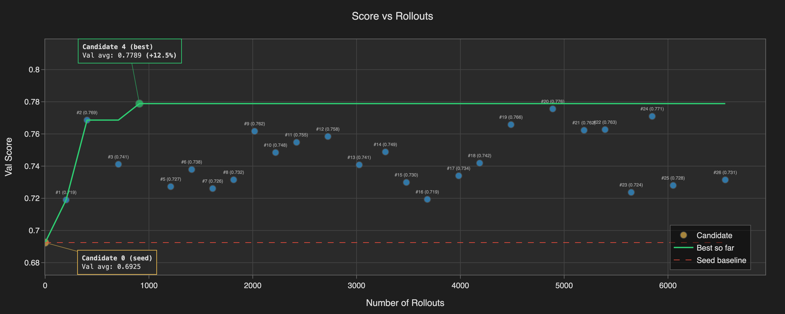
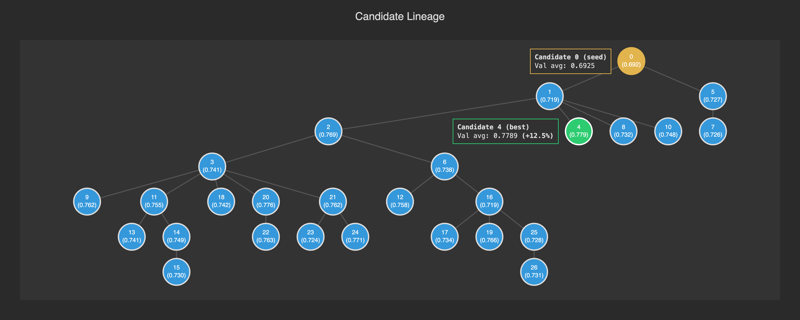

# RLM ♥ GEPA: You can use RLMs to improve RLMs with GEPA

> [!NOTE]
> Originally published as an
> [X Article](https://x.com/i/article/2046247680255344640).

**TL;DR** We adapt GEPA so a
[predict-RLM](https://github.com/trampoline-ai/predict-rlm) improves another
predict-RLM.

On our held-out 400-task [SpreadsheetBench](https://spreadsheetbench.github.io/)
Verified eval, RLM_gpt-5.5-medium reaches 0.8925 hard, which would tie the
current public #3 under the same protocol; RLM_gpt-5.4-medium reaches 0.8500
hard, which would land at #5.

That is a 23% and 27% hard-error reduction over their respective unoptimized
seed baselines.

That would make our predict-RLM ♥ GEPA optimized skill the only open-source
solution in SpreadsheetBench Verified top-5 territory.

The optimized skill is
[available on GitHub today](https://github.com/trampoline-ai/predict-rlm).

Caption: candidate lineage

[Recursive Language Models](https://arxiv.org/abs/2512.24601)
([Alex L. Zhang](https://x.com/a1zhang) et al.) traces are large: a single eval
batch can easily exceed 10M tokens. [GEPA](https://arxiv.org/abs/2507.19457)
([Lakshya Agrawal](https://x.com/LakshyAAAgrawal) et al.) optimizes prompts
through structured reflection: a proposer LM reads execution outcomes,
identifies failure patterns, and rewrites the prompt.

Stock GEPA's proposer sees a compact rendered summary of each task; by wiring a
predict-RLM as the proposer, we expose the full trace corpus and let the
proposer read, filter, and distill it programmatically, thereby letting the
model reason over the full execution evidence rather than a lossy summary.

Same tool stack, same iteration protocol, applied recursively.

The learner and the learned share both architecture and tool stack.

We apply this pattern to SpreadsheetBench, using gpt-5.4-mini as a cheap RLM
executor to keep optimization costs low. The evolved skill transfers upward to
frontier executors unchanged. On the verified 400-task test set, it lifts
gpt-5.4-medium from a seed of 0.8750 soft / 0.7950 hard to 0.9259 / 0.8500 —
closing 41% of the remaining soft-score error.

The evolved skill and model capabilities compound: gpt-5.5-medium with our
optimized skill strictly outperforms gpt-5.4-medium with the same optimized
skill, suggesting that we capture model-agnostic gains that stack with stronger
executors rather than constraining them.

## 1. Motivation

Our work aligns with [Alex L. Zhang](https://x.com/a1zhang)'s
[Mismanaged Geniuses Hypothesis (MGH)](https://alexzhang13.github.io/blog/2026/mgh/):
frontier models already contain the capability needed for deep reasoning, but
are bottlenecked by how we elicit, structure, and compose that capability.

We test how far this intuition stretches on tasks directly applicable to the
day-to-day work of millions of knowledge workers: spreadsheet manipulation.

Our prior work on [predict-RLM](https://github.com/Trampoline-AI/predict-rlm), a
production-focused port of RLMs with an integrated predict() sub-tool, DSPy
signatures for inputs/outputs/tools, and fully interpretable trajectories,
formed the base architecture of this bet.

Here, we ask the empirical question: how far can a simple predict-RLM be pushed
against SOTA and specialized agents on SpreadsheetBench purely by managing the
model better, rather than swapping the model?

To answer this, we pair RLMs with GEPA prompt optimization, and replace the
standard proposer with an RLM: an RLM proposer reads, filters, and distills
another RLM’s execution traces, then proposes improved prompts for the next
iteration.

The same architecture optimizes itself: one RLM improves another RLM without
updating model weights. We improve an RLM without updating model weights, by
using another RLM.

## 2. SpreadsheetBench

SpreadsheetBench (Ma et al., 2024) is a benchmark of 912 real-world spreadsheet
manipulation tasks derived from Excel forum questions. Each task provides a
natural-language instruction, spreadsheet files, and golden outputs used for
exact-match evaluation.

The benchmark reports two metrics:

- Soft score = partial credit for passing some test cases.
- Hard score = full credit only when all test cases pass.

We use the SpreadsheetBench Verified 400-task subset as a held-out test set and
never expose it to the optimizer. From the remaining 512 tasks, we construct
disjoint train and validation splits for RLM-GEPA: train examples generate
traces and prompt proposals, while validation examples are used for candidate
selection.

Because the optimization pool is the non-Verified remainder of the benchmark, we
treat Verified performance as held-out transfer from a noisier, less curated
training distribution rather than as in-distribution tuning.

## 3. Skill as a First-Class Artifact

Predict-RLM instances can optionally be accompanied by a skill — a bundle of
(instructions, pypi_packages, tools) describing a domain.

When present, skills are merged automatically: instructions are concatenated,
packages are loaded, and tools are exposed alongside predict() in the sandbox.

For our seed baseline skill instructions, we adapt
[OpenAI's curated spreadsheet skill](https://raw.githubusercontent.com/openai/skills/e6afb0d74cc75d220df2faf3dd6c635c2dc6a108/skills/.curated/spreadsheet/SKILL.md)
with minimal changes.

This skill + RLM combination is our seed baseline. The skill is also the target
of GEPA optimization.

## 4. Baselines

Before optimization, we measured the seed baseline (§3) across reasoning-effort
tiers on the full 400-task testset.

| Model   | Reasoning effort |   Soft |             Hard |
| ------- | ---------------- | -----: | ---------------: |
| gpt-5.4 | low              | 0.8710 | 0.7800 (312/400) |
| gpt-5.4 | medium           | 0.8750 | 0.7950 (318/400) |
| gpt-5.5 | low              | 0.9092 | 0.8500 (340/400) |
| gpt-5.5 | medium           | 0.9142 | 0.8600 (344/400) |

Caption: Seed skill + RLM(model*) baselines

Higher reasoning tiers are omitted from the main table because the tracked run
artifacts do not support a stronger baseline result than medium: more thinking
did not seem to readily improve performance on this workload.

Importantly, the plateau is the signal. Higher reasoning effort did not buy us
much. In some settings it even made things worse, because many remaining
failures were not about solving the spreadsheet task in the abstract; they were
about operating the spreadsheet environment correctly.

This is MGH made concrete. The model had enough reasoning capacity to solve many
more of these tasks, but kept losing points at the interface: openpyxl quirks,
sandbox behavior, formula-prefix conventions, type coercion rules, workbook
mutation semantics, and instruction interpretation.

More thinking is a blunt tool for that. Better operating instructions are
sharper.

That is what the skill is. GEPA turns the skill from a hand-written prompt into
an optimized artifact: read traces, find recurring mistakes, rewrite the
instructions, run again. Same model family, same tools, better management.

## 5. Results

| Model         | Soft: seed → opt ↓err | Hard: seed → opt ↓err |   $/task seed → opt |
| ------------- | --------------------: | --------------------: | ------------------: |
| gpt-5.4 - low |  0.8710 → 0.8980 ↓21% |  0.7800 → 0.8150 ↓16% | $0.078 → $0.084 ↑7% |
| gpt-5.4 - med |  0.8750 → 0.9259 ↓41% |  0.7950 → 0.8500 ↓27% | $0.089 → $0.094 ↑6% |
| gpt-5.5 - low |  0.9092 → 0.9288 ↓22% |  0.8500 → 0.8775 ↓18% | $0.119 → $0.110 ↓8% |
| gpt-5.5 - med |  0.9142 → 0.9411 ↓31% |  0.8600 → 0.8925 ↓23% | $0.134 → $0.139 ↑4% |

_Seed skill vs. RLM♥GEPA optimized skill on the held-out 400-task
SpreadsheetBench Verified set. Error reduction is measured against remaining
error, e.g. hard error = 1 − hard score._

The table is the story: the optimized skill improves every executor setting we
measured.

The strongest final result is RLM_gpt-5.5-medium + optimized skill: 0.9411 soft
/ 0.8925 hard, or 357 / 400 all-pass. Relative to seed, that closes 31% of the
remaining soft error and 23% of the remaining hard error.

The largest lift is RLM_gpt-5.4-medium: 0.8750 / 0.7950 → 0.9259 / 0.8500, or
318 → 340 all-pass. That is a 41% soft-error reduction and a 27% hard-error
reduction at roughly flat per-task cost.

Two things matter.

First: transfer. The skill was evolved by watching gpt-5.4-mini fail, then
deployed unchanged on stronger executors. That suggests the traces captured
domain/tool knowledge — spreadsheet conventions, openpyxl pitfalls, formula
handling, task interpretation — not weak-model crutches.

Second: cost. Per-task cost stays basically flat, from −8% to +7% depending on
the executor. The gain is not from simply buying more inference at deployment.
It comes from a better skill; the optimization cost is paid once and amortized
downstream.

The thinking ceiling persists. Higher reasoning tiers did not reliably beat
medium. gpt-5.5-high, not shown in the table, scored lower than gpt-5.5-medium
while costing ~40% more. For this workload, medium was the practical ceiling in
our runs. Better operating instructions beat more thinking.

Same model family. Same tools. Same executor architecture. Better management.

## 6. What's next?

I do not think SpreadsheetBench is unique. My intuition is that we can apply
this RLM♥GEPA approach to many more problems and many more benchmarks.

The loop is simple: cheap executor RLM produces readable traces → proposer RLM
distills them into a skill patch → stronger executor RLM runs again.

[predict-RLM](https://github.com/trampoline-ai/predict-rlm) is on GitHub, MIT
licensed. The optimized SpreadsheetBench skill is available now.

The RLM♥GEPA adapter is next in the coming days.

Like, star, & follow for more ;-)

with ♥ from MTL
