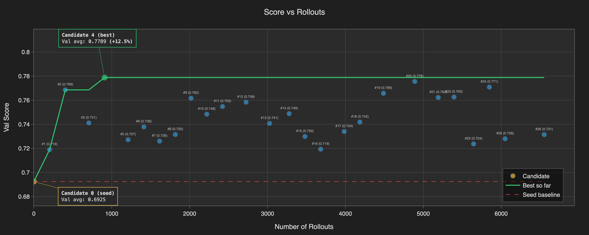
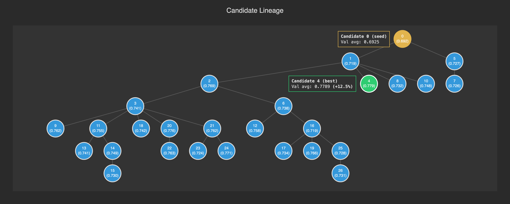

# RLM-GEPA

RLM-GEPA optimizes reusable PredictRLM artifacts, usually skill instructions,
from execution traces. A project defines the agent to run, the train/validation
examples to evaluate, and an `AgentSpec` that tells the proposer what kind of
behavioral improvements are in-scope.

Install the released package with the GEPA extra:

```bash
pip install "predict-rlm[gepa]"
```

## Mental model

RLM-GEPA has two loops:

1. **Executor loop**: run a candidate RLM/skill on train or validation examples,
   collect `RunTrace` objects, scores, outputs, and evaluator feedback.
2. **Proposer loop**: read scored traces and produce a surgical edit to one text
   component, such as `skill_instructions`.

`AgentSpec` tells GEPA what kind of reusable behavior is worth improving. It
captures the product and optimization context GEPA cannot infer: real use cases,
runtime constraints, scoring signal, and what counts as a transferable
improvement versus a benchmark-specific hack. Budget knobs such as
`max_metric_calls` and `minibatch_size` control how much search happens;
`AgentSpec` controls what kind of changes the proposer considers valuable.

## Start with coding-agent skills

This repository ships two complementary coding-agent skills:

- [`/rlm`](../../.agents/skills/rlm/SKILL.md) designs and builds the base
  PredictRLM.
- [`/rlm-gepa`](../../.agents/skills/rlm-gepa/SKILL.md) adds evaluation and
  RLM-GEPA optimization after the base RLM works.

Install the repository skills in Claude Code, Codex, Cursor, or another
compatible coding agent:

```bash
npx skills add Trampoline-AI/predict-rlm
```

First create the RLM and its observable boundary:

```text
/rlm interview me to design a PredictRLM that extracts renewal terms, pricing
changes, and notice windows from vendor contracts. Then build the RLM and
evaluation fixtures.
```

Then use the optimization skill with the completed RLM, representative examples,
and a scoring rule:

```text
/rlm-gepa add train/validation optimization for the contract RLM. Optimize its
domain instructions, keep official test data held out, and run optimize --check
before a budgeted run.
```

The concrete RLM remains the source of truth for the DSPy signature and tools.
The RLM-GEPA project derives those fields through `agent_spec_from_rlm(...)` and
adds only the optimization context the RLM cannot infer: transfer use cases,
runtime grounding, scoring feedback, and anti-overfitting boundaries.

The RLM-GEPA skill creates the project-local `gepa/` package:

```text
my_rlm/
├── agent/           # PredictRLM signature, schema, service, skills/tools
├── bench/           # train/validation examples, loaders, scoring feedback
└── gepa/            # RLMGepaProject, AgentSpec, OptimizeConfig, CLI glue
```

The generated GEPA layer owns task loading, metric feedback, seed candidate
text, and defaults. The shared `rlm_gepa` package supplies generic optimization,
trace capture, and CLI helpers.

## Minimal project shape

Create a project by subclassing `RLMGepaProject`. Existing code can still
construct `AgentSpec` manually, but new projects should prefer
`agent_spec_from_rlm(...)` so the RLM stays the source of truth for the DSPy
signature and tools.

```python
from __future__ import annotations

from dataclasses import dataclass
from typing import Any

from predict_rlm import PredictRLM, Skill
from predict_rlm.trace import RunTrace
from rlm_gepa import EvaluationContext, RLMGepaExampleResult, RLMGepaProject, agent_spec_from_rlm

from .signature import AnalyzeDocuments


SEED_SKILL_INSTRUCTIONS = "Initial domain instructions for the RLM."


@dataclass
class EvalExample:
    example_id: str
    rlm_kwargs: dict[str, Any]
    reference: Any


def score_result(result: Any, reference: Any) -> tuple[float, str]:
    """Project-specific deterministic scorer."""
    raise NotImplementedError


def build_rlm(
    skill_instructions: str,
    *,
    lm=None,
    sub_lm=None,
    max_iterations: int = 30,
    verbose: bool = False,
    debug: bool = False,
):
    return PredictRLM(
        AnalyzeDocuments,
        lm=lm,
        sub_lm=sub_lm,
        max_iterations=max_iterations,
        verbose=verbose,
        debug=debug,
        skills=[Skill(name="document-analysis", instructions=skill_instructions)],
    )


class MyProject(RLMGepaProject):
    project_name = "my-project"
    components = ("skill_instructions",)
    agent_spec = agent_spec_from_rlm(
        build_rlm(SEED_SKILL_INSTRUCTIONS),
        use_cases=[
            "contract review with clause-level citations",
            "invoice analysis with total reconciliation",
            "policy compliance checks over long PDFs",
        ],
        runtime_grounding_examples={
            "skills": ["document-analysis skill instructions are the optimized component"],
            "sandbox facts": ["Pyodide filesystem paths and package limits"],
            "document behaviors": ["tables may span pages", "OCR text can be missing"],
        },
        scoring_description=(
            "Score combines answer correctness and citation support. Feedback names "
            "missing findings, unsupported citations, and extraction errors."
        ),
    )

    def seed_candidate(self) -> dict[str, str]:
        return {"skill_instructions": SEED_SKILL_INSTRUCTIONS}

    def load_trainset(self):
        return [...]  # examples used to propose and gate candidate edits

    def load_valset(self):
        return [...]  # held-out validation examples used for candidate selection

    async def evaluate_example(
        self,
        candidate: dict[str, str],
        example: EvalExample,
        context: EvaluationContext,
    ) -> RLMGepaExampleResult:
        # 1. Construct the same PredictRLM with candidate["skill_instructions"].
        rlm = build_rlm(
            candidate["skill_instructions"],
            lm=context.lm,
            sub_lm=context.sub_lm,
            max_iterations=context.max_iterations,
            verbose=context.verbose_rlm,
            debug=context.debug_rlm,
        )
        # 2. Run it on the concrete example shape for this project, then score it.
        # `rlm_kwargs` should match the DSPy signature fields passed to build_rlm(...).
        result: Any = await rlm.acall(**example.rlm_kwargs)
        score: float
        feedback: str
        score, feedback = score_result(result, example.reference)

        trace: RunTrace | None = getattr(result, "trace", None)
        traces: list[RunTrace] = [trace] if trace is not None else []
        rlm_inputs: dict[str, Any] = {"example_id": example.example_id, **example.rlm_kwargs}

        # 3. Return score, feedback, and captured RunTrace objects.
        return RLMGepaExampleResult(
            score=score,
            feedback=feedback,
            traces=traces,
            rlm_inputs=rlm_inputs,
            example_id=example.example_id,
        )
```

`seed_candidate()` must return exactly the keys listed in `components`. Each
value is a mutable text component. The most common single-component setup is
`("skill_instructions",)`, but multi-component projects can optimize several
instruction blocks. Override `component_focus(component_name)` when each
component needs a different proposer brief.

## Project CLI

RLM-GEPA projects should feel like a product CLI: from the project root, run
`uv run rlm-gepa ...` for checks, evals, optimization, stats, and plots. When
the `/rlm-gepa` skill scaffolds an optimization project, it should set this up
in `pyproject.toml` for you:

```toml
[project.scripts]
rlm-gepa = "my_rlm.gepa:main"
```

The generated `my_rlm.gepa:main` should call `run_project_cli(...)`, using the
project's `RLMGepaProject` and `OptimizeConfig` defaults. If you are wiring a
project manually, this script entry is required; without it,
`uv run rlm-gepa ...` will not resolve inside the project.

A minimal manual wrapper looks like:

```python
from rlm_gepa.cli import run_project_cli

from .config import default_config
from .project import build_project


def main() -> int:
    return run_project_cli(build_project, default_config())
```

### Eval

If the project has a `bench/` package, expose its seed, validation, and held-out
evaluation flow as an `eval` subcommand on the same CLI:

```bash
# Smoke-test the validation set wiring before spending on a full run.
uv run rlm-gepa eval --dataset validation --limit 5

# Evaluate the best candidate from an optimization run.
uv run rlm-gepa eval --dataset testset --run-dir runs/<run-dir>
```

The `eval` subcommand is project-specific because datasets and metrics are
project-specific. Agent-only or optimization-only projects do not need a
held-out `eval` command unless the user asks for one.

Use `--verbose-rlm` to print human-readable RLM trace blocks during eval:
reasoning, generated code, output, tool calls, errors, and `SUBMIT` payloads.
Use `--debug-rlm` for timestamped RLM and sandbox lifecycle diagnostics.

### Optimize

Use `optimize --check` before a real run. It validates that the project can load
train/validation examples and build the optimizer without spending the full
search budget:

```bash
uv run rlm-gepa optimize --check
```

For a real run, set the common runtime knobs in the optimize command:

```bash
optimize_args=(
  # Main budget: total train/validation metric calls.
  --max-metric-calls 1000

  # Evidence per proposal step: larger batches cost more but give broader signal.
  --minibatch-size 25

  # Executor cap: maximum PredictRLM iterations per rollout.
  --max-iterations 30

  # Throughput: parallel rollouts; affects rate pressure, not the objective.
  --concurrency 8

  # Proposer model pair.
  --proposer-lm anthropic/claude-sonnet-4-6
  --proposer-sub-lm openai/gpt-5.4-mini

  # Parent-selection strategy.
  --candidate-selection-strategy pareto

  # Optional patch crossover.
  --merge-proposer
)

uv run rlm-gepa optimize "${optimize_args[@]}"
```

Use `AgentSpec`, seed instructions, evaluator feedback, and `component_focus()`
to steer _what kinds of behaviors_ GEPA explores. Use CLI/runtime args to steer
_how much search_ is performed.

`optimize` accepts `--verbose-rlm` and `--debug-rlm` with the same meanings as
the eval command. The flags are forwarded into executor rollouts, instruction
proposer RLMs, and patch-merge proposer RLMs.

The CLI calls the same Python API, so embedding is still available when you need
it:

```python
from rlm_gepa import OptimizeConfig, run_optimization

report = run_optimization(MyProject(), OptimizeConfig(max_metric_calls=1000))
print(report.run_dir)
print(report.best_candidate)
```

### Stats and plots

Every optimization run writes artifacts under `run_dir`:

- `run_metadata.json`: resolved config and command;
- `gepa_state.bin`: optimizer state and candidate lineage;
- `optimization_summary.json`: best candidate and aggregate scores;
- `all_candidates.json`: all candidate texts and scores;
- `task_traces/`: per-example rollout traces;
- `proposer_traces/`: proposer RLM traces;
- `cost_log.jsonl`: token/cost accounting.

After `optimize` prints a `run_dir`, use the project CLI to inspect stats:

```bash
# Full terminal summary: iterations, candidates, tasks, merges, and costs.
uv run rlm-gepa stats runs/<run-dir> --format terminal

# Focus on one stats table while debugging budget or selection behavior.
uv run rlm-gepa stats runs/<run-dir> --table candidates
uv run rlm-gepa stats runs/<run-dir> --table iterations

# Markdown output is useful for PR notes or experiment reports.
uv run rlm-gepa stats runs/<run-dir> --format markdown

# Plots are separate from stats.
uv run rlm-gepa plot runs/<run-dir>
```

Example `--table iterations --format markdown` output:

| iter     | soft: par → child    | hard: par → child              | flips    | p    | outcome  |
| -------- | -------------------- | ------------------------------ | -------- | ---- | -------- |
| 0 [0]    | 0.500 → 1.000 +0.500 | 0.500 → 1.000 +0.500; 1 → 2 /2 | +1/-0 +1 | 1.00 | → cand 1 |
| 1 [0, 1] | 1.000 → 1.000 +0.000 | 0.500 → 0.500 +0.000; 1 → 1 /2 | +0/-0 +0 | 1.00 | REJECTED |

Example plot artifacts from the SpreadsheetBench run:

<table>
  <tr>
    <td>
      <a href="../../examples/spreadbench/blog_assets/score_vs_rollouts.png">
        
      </a>
      <br>
      <sub>Score vs. rollouts</sub>
    </td>
    <td>
      <a href="../../examples/spreadbench/blog_assets/candidate_lineage.png">
        
      </a>
      <br>
      <sub>Candidate lineage</sub>
    </td>
  </tr>
</table>

The same example run is documented in
[`examples/spreadbench/run_artifacts/README.md`](../../examples/spreadbench/run_artifacts/README.md).

## Deriving `AgentSpec` from an RLM

For new projects, build the concrete `PredictRLM` first and call
`agent_spec_from_rlm(...)`. The RLM stays the source of truth for the DSPy
signature and tools; the helper derives `target_signature` and
`tool_signatures`. You only add the context GEPA cannot infer:

- `use_cases`: real uses that define the transfer boundary.
- `runtime_grounding_examples`: concrete tool, library, sandbox, protocol, file,
  or evaluator-visible facts the proposer can rely on.
- `scoring_description`: how score and feedback work, including partial credit
  and hard failures.
- `counterfactual_axis_name`: the registered generalization axis.
- `domain_conventions_note`: optional boundaries between true domain rules and
  benchmark artifacts.

Manual `AgentSpec` construction is still supported for existing code and custom
proposer plumbing, but it should not be the default path. Leave trace mount
fields at their defaults unless you are changing how proposer traces are
mounted.

When writing the extra context, prefer runtime facts over intentions, keep use
cases broad enough to discourage benchmark hacks, and do not restate anything
`agent_spec_from_rlm(...)` can derive from the RLM.

### Context directionality examples

If you want the optimizer to discover better **tool use**, add concrete tool
contracts and failure feedback:

```python
runtime_grounding_examples={
    "tool contracts": ["render(path, cell_range, sheet_name) returns a PNG preview"],
    "library symbols": ["openpyxl `MergedCell`, `cell.data_type`, `iter_rows`"],
    "sandbox facts": ["large workbooks can hit Pyodide wall-clock limits"],
}
scoring_description="Feedback names wrong cells, stale formulas, and render mismatches."
```

If you want better **generalization**, widen `use_cases` and choose a useful
counterfactual axis:

```python
use_cases=[
    "financial workbooks with formulas and cross-sheet references",
    "operational trackers with merged headers and status rollups",
    "data-cleaning sheets with inconsistent formats",
]
counterfactual_axis_name="task shapes"
```

If you want fewer **benchmark hacks**, make the anti-hack boundary explicit:

```python
domain_conventions_note=(
    "Rules must transfer to unseen files. Do not key behavior on benchmark file "
    "names, task IDs, row counts, or reference-answer artifacts."
)
```

## Evaluation result quality

As with base GEPA, optimization quality is bounded by the evidence your metric
returns. In RLM-GEPA, each `evaluate_example()` should return:

- finite `score`, usually normalized to `0.0-1.0`;
- concrete `feedback` for imperfect outputs;
- captured `traces` from the candidate RLM run;
- stable `example_id` values, especially for debugging and merge traces;
- `rlm_inputs` with the task metadata needed to interpret a trace.

Weak feedback produces weak prompt search. Good feedback names the failing
surface: the cell, clause, page, API response, assertion, crash reason, timeout,
or schema mismatch. It should tell the proposer what happened, not what text to
write.
